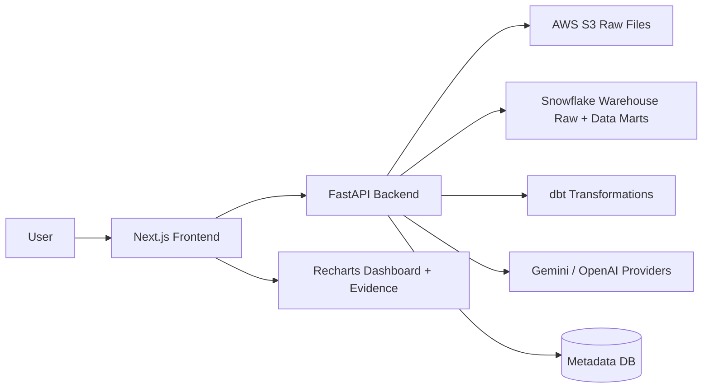

<p align="center">
  
</p>

# MeshFlow

MeshFlow is a warehouse-first AI analytics engineering demo workspace that turns raw datasets into Snowflake/dbt-backed data flows, dimensional models, Data Marts, AI-generated analysis runs, Recharts dashboards, insights, and evidence.

It is a portfolio-grade demo project, not a production SaaS. Successful data processing uses real AWS S3, Snowflake, and dbt. MeshFlow does not use DuckDB, local fake analytics execution, mock dbt success, or fake successful AI fallback paths.

<p>
  
  
  
  
  
  
  
  
  
  
  
  
  
  
</p>

[What Is MeshFlow?](#what-is-meshflow) | [Why It Matters](#why-it-matters) | [Highlights](#highlights) | [Demo Flow](#demo-flow) | [Architecture](#architecture) | [AI Workflow](#ai-workflow) | [Demo Limits](#demo-limits) | [Local Development](#local-development) | [Safety And Boundaries](#safety-and-boundaries) | [Status](#status)

**Live Demo:** not deployed yet

**Backend API:** local / deployment pending

## What Is MeshFlow?

MeshFlow is an AI analytics engineering workspace that prepares raw data through a real warehouse path:

```text
Dataset
-> AWS S3
-> Snowflake Warehouse Raw
-> dbt Staging
-> Intermediate
-> Dimensional Model
-> Data Marts
-> AI Analytics Engineer
-> Dashboard
```

The workspace supports a curated **Raw Retail Transactions Demo** and uploaded CSV datasets. It profiles raw warehouse data, supports semantic column mapping, runs dbt transformations, generates post-Data-Marts question suggestions, creates AI analysis runs, renders validated ChartSpecs with Recharts, and keeps an evidence trail for history and analysis detail.

## Why It Matters

| Theme | Why it matters |
|---|---|
| Warehouse-first processing | Successful data work goes through S3, Snowflake, and dbt instead of local mock analytics. |
| Analytics engineering structure | Raw inputs become Staging, Intermediate, Dimensional Model, and Data Marts before analysis. |
| AI with validation | AI proposes mappings, plans, modeling ideas, and insights; the backend validates before accepting output. |
| Evidence-backed dashboards | Charts, SQL, preview rows, ChartSpecs, provider evidence, and snapshots stay inspectable. |

## Highlights

- Compact workspace with four pages: Upload Dataset, Data Flow, Dashboard, and History.
- Raw Retail Transactions Demo plus uploaded CSV support.
- Real S3 object storage and Snowflake Warehouse Raw loading.
- dbt Staging, Intermediate, Dimensional Model, and Data Marts.
- AI semantic column mapping for schema review.
- Suggested questions generated after Data Marts from the backend-known mart catalog.
- AI analysis plan generation followed by backend-generated Snowflake SELECT execution.
- Backend-owned ChartSpec generation rendered through Recharts.
- AI insights generated only after real Snowflake result preview data exists.
- History and Analysis Detail drawer with SQL, output schema, preview rows, ChartSpec JSON, charts, insights, provider evidence, and warnings.
- Persisted dashboard cards with snapshots and quota enforcement.
- Dataset delete, reset, expiry, and cleanup safeguards that preserve successful quota usage.

## Demo Flow

| Step | What happens |
|---|---|
| Launch workspace | Create or continue an anonymous demo session. |
| Use demo data or upload CSV | Load raw input through S3 and Snowflake Warehouse Raw. |
| Review schema | Inspect profile data and semantic column mappings. |
| Transform | Run dbt through Staging, Intermediate, Dimensional Model, and Data Marts. |
| Ask AI Analytics Engineer | Create a validated analysis run against an attached ready dataset. |
| Inspect charts and insights | View Recharts cards and AI insights generated from result previews. |
| Open History / Detail | Inspect SQL, ChartSpec, preview rows, provider evidence, and status. |
| Reset / cleanup | Clear workspace data while preserving public quota usage. |

## Architecture



How it works:

- Frontend owns the workspace UX, routes, chart display, drawers, and honest loading/error states.
- Backend owns sessions, validation, warehouse/dbt orchestration, provider routing, quotas, and cleanup.
- S3 stores raw uploaded and demo files under session-scoped keys.
- Snowflake runs Warehouse Raw loads and analytical SELECT queries.
- dbt builds Staging, Intermediate, Dimensional Model, and Data Marts.
- AI providers suggest mappings, modeling proposals, analysis plans, and insights, but backend validation decides what becomes trusted product state.
- Dashboard cards store snapshots so history and dashboards remain readable after dataset deletion.

## AI Workflow

Active Gemini configuration:

```text
GEMINI_API_KEY_1
GEMINI_API_KEY_2
GEMINI_MODEL_1
GEMINI_MODEL_2
```

There is no active Gemini lane 3.

Provider routing for semantic preparation, question suggestions, analysis plans, and insights:

```text
GEMINI_MODEL_1 with key 1/2
-> OpenAI
-> GEMINI_MODEL_2 with key 1/2
-> honest failure
```

Provider routing for uploaded CSV modeling proposals:

```text
GEMINI_MODEL_1 with key 1/2
-> GEMINI_MODEL_2 with key 1/2
-> OpenAI
-> honest failure
```

Rules:

- No deterministic fake fallback.
- Semantic preparation is column mapping only.
- Suggested questions are generated after dbt/Data Marts.
- AI proposes; backend validates.
- Analysis plan providers do not provide trusted executable SQL.
- Insights are generated only after actual Snowflake result data and ChartSpecs exist.

## Demo Limits

Public demo limits protect hosted resources.

| Limit | Current rule |
|---|---|
| Anonymous session lifetime | 3 days |
| Demo dataset | Active duplicate prevented |
| Upload quota | Storage-based |
| Upload storage | 10 MB per session |
| File-size safety limit | 5 MB per file |
| Successful analysis runs | 8 per session |
| Dashboard cards | 8 per session |
| Charts per analysis | Prefer 1, max 3 |
| Dashboard | 1 dashboard per session |
| Reset | Clears workspace data but preserves public quota usage |
| Delete | Does not restore used quota |
| Expired sessions | Cleaned up opportunistically / by cleanup flow |

## Supported Uploads

- CSV only in the current MVP.
- UTF-8 CSV with a header row.
- File validation checks type, size, headers, row parseability, Snowflake-safe names, and storage quota.
- Upload success requires S3 and Snowflake readiness.
- Uploaded CSV modeling is conservative and may need clear semantic mappings before transformation.

## Project Structure

```text
MeshFlow/
  backend/                  FastAPI API, services, SQLAlchemy models, Alembic, tests
  frontend/                 Next.js app, workspace UI, Recharts components
  docs/scopian/sources/     Canonical product, architecture, API, UX, and data specs
```

Local-only folders such as `docs/prompts/`, `docs/progress/`, `docs/audit/`, and `_reference/` are ignored and should not be committed. Backend and frontend install separately; there is no root app package manager.

## Local Development

### Backend

```powershell
cd backend
py -3.11 -m venv .venv-dbt
.\.venv-dbt\Scripts\python.exe -m pip install -r requirements.txt -r requirements-dev.txt
Copy-Item .env.example .env
.\.venv-dbt\Scripts\alembic.exe upgrade head
.\.venv-dbt\Scripts\python.exe -m uvicorn app.main:app --host 127.0.0.1 --port 8000
```

dbt runtime note:

- Current live dbt smoke was verified with Python 3.11 and `backend/.venv-dbt`.
- dbt 1.11 did not run under Python 3.14 locally because of dependency compatibility.
- Use a Python version compatible with dbt 1.11 for live dbt execution.
- Runtime compatibility failures should report setup-required/failed states, not fake dbt success.

Quick dbt check:

```powershell
cd backend
.\.venv-dbt\Scripts\dbt.exe --version
```

### Frontend

```powershell
cd frontend
npm install
Copy-Item .env.example .env
npm run dev
```

Default local URLs:

```text
Frontend: http://localhost:3000
Backend API: http://localhost:8000/api/v1
```

## Environment Checklist

Backend categories:

- `DATABASE_URL`
- app environment, debug, version, and CORS origins
- demo session retention and quota settings
- AWS S3 bucket, upload prefix, region, and credentials
- Snowflake account, user, password, role, warehouse, database, schema, and stage
- dbt runtime directories, target, and threads
- Gemini provider keys and model names
- OpenAI provider key and model name

Frontend:

- `NEXT_PUBLIC_API_BASE_URL`

Do not commit `.env` files, provider keys, warehouse credentials, or storage credentials.

## Status

Current validation status:

- Backend automated tests have passed locally.
- Frontend typecheck, lint, and production build have passed locally.
- Live local smoke has passed against configured AWS S3 and Snowflake for raw upload/load.
- Live dbt transformation has passed through Staging, Intermediate, Dimensional Model, and Data Marts.
- Live OpenAI analysis planning, Snowflake analytical SELECT, ChartSpec generation, Gemini insight generation, dashboard card persistence, and cleanup have been validated locally.
- Hosted deployment is not included yet.

## Safety And Boundaries

- No fake success paths.
- No DuckDB or local analytics execution.
- Provider keys and raw secrets are not exposed to the frontend.
- Provider output is not trusted until backend validation passes.
- Public reset clears workspace data but preserves quota usage.
- Delete/reset do not restore used quota.
- Dashboard and history use stored snapshots.
- External cleanup is best-effort and reports completed, skipped, not configured, or failed statuses honestly.
- This is not production SaaS, auth, billing, team-account, or multi-tenant scope.

## License

No license file is currently present.
