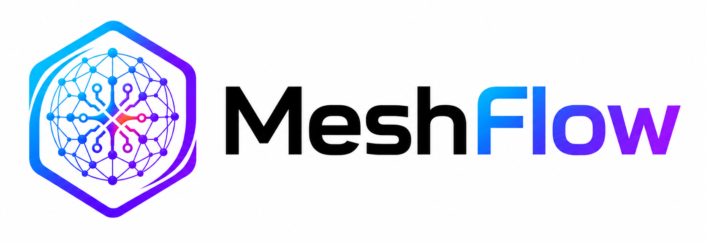
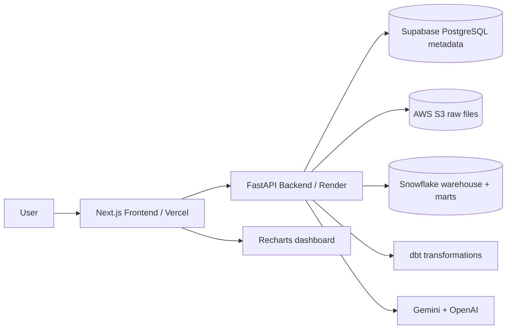

<p align="center">
  
</p>

# MeshFlow

Warehouse-first AI analytics engineering demo workspace.

Turn raw datasets into S3-backed Snowflake raw tables, dbt Data Marts, AI analysis runs, Recharts dashboard cards, insights, and inspectable evidence.

MeshFlow is a demo project, not production SaaS. It uses real AWS S3, Snowflake, and dbt for successful data processing. It does not use DuckDB, local fake analytics execution, or fake success paths.

<p>
  
  
  
  
  
  
  
  
  
  
  
</p>

Demo Flow | Architecture | Engineering Highlights | Local Development | Deployment

Live Demo: not deployed yet | Backend API: local / deployment pending

---

## What Is MeshFlow?

MeshFlow shows how an AI analytics workspace can move from raw data to trusted dashboard output:

```text
Dataset -> AWS S3 -> Snowflake Warehouse Raw -> dbt -> Data Marts -> AI Analytics Engineer -> Dashboard
```

The demo includes a raw denormalized retail dataset and a CSV upload flow. MeshFlow profiles raw columns, supports semantic column mapping, builds warehouse/dbt models, generates analysis plans, runs Snowflake SELECT queries, renders Recharts cards, and stores evidence for History and Analysis Detail.

## Why It Matters

| Theme | Why it matters |
|---|---|
| Warehouse-first analytics | Successful data work goes through S3, Snowflake, and dbt instead of local mock execution. |
| Visible data preparation | Users can inspect raw schema, mappings, transformation evidence, marts, and model relationships. |
| AI with validation | Providers propose mappings, plans, questions, and insights; backend validation decides what is accepted. |
| Evidence-backed dashboards | SQL, ChartSpec JSON, preview rows, provider evidence, insights, and snapshots remain inspectable. |

## Highlights

**Data workflow**
- Raw Retail Transactions Demo and CSV upload.
- S3 upload plus Snowflake Warehouse Raw load.
- dbt Staging, Intermediate, Dimensional Model, and Data Marts.
- Post-Data-Marts question suggestions.

**AI analytics**
- Semantic column mapping suggestions.
- AI-generated analysis plans with backend validation.
- Snowflake analytical SELECT execution.
- Backend-owned ChartSpec generation and Recharts rendering.
- AI insights from actual result previews.

**Workspace**
- Four main pages: Upload Dataset, Data Flow, Dashboard, History.
- Persisted dashboard cards with remove, compact/expand, and add-from-history behavior.
- Analysis Detail drawer with SQL, output schema, preview rows, ChartSpec, charts, insights, and provider evidence.
- Dataset delete and Reset Demo preserve successful quota usage and keep historical snapshots readable.

## Demo Flow

| Step | Action | What to notice |
|---|---|---|
| 1 | Launch demo session | Anonymous session with visible usage limits. |
| 2 | Add data | Use the retail demo or upload a CSV after validation/readiness checks. |
| 3 | Review schema | Inspect raw columns, profiles, examples, and semantic mappings. |
| 4 | Transform | Run dbt into modeled Data Marts. |
| 5 | Ask AI Analytics Engineer | Generate a validated plan for an attached ready dataset. |
| 6 | View dashboard result | Inspect the chart, insight, dataset, source model, and saved card. |
| 7 | Open History / Evidence | Review SQL, ChartSpec, preview rows, provider chain, and warnings. |
| 8 | Delete or reset | Clear active workspace data without restoring public quota usage. |

The demo is intentionally resource-limited: no account wall, clear quota display, honest setup/readiness failures, and no fake generated data.

## Architecture



How it works:

- The frontend creates or restores a demo session and renders upload, data-flow, dashboard, and history views.
- The backend owns sessions, validation, storage, warehouse/dbt orchestration, provider routing, quotas, cleanup, and evidence snapshots.
- Supabase PostgreSQL stores metadata only; Snowflake is the analytical warehouse.
- AWS S3 stores raw uploaded/demo files.
- dbt builds Staging, Intermediate, Dimensional Model, and Data Marts against Snowflake.
- Gemini and OpenAI provide structured AI output; backend validation remains the trust gate.

| Layer | Stack |
|---|---|
| Frontend | Next.js, TypeScript, Tailwind CSS, Recharts |
| Backend | FastAPI, SQLAlchemy, Alembic, Pydantic |
| Metadata DB | Supabase PostgreSQL |
| Storage | AWS S3 |
| Warehouse | Snowflake |
| Transformations | dbt, dbt-snowflake |
| AI | Gemini, OpenAI |
| Quality / scope workflow | pytest, Scopian, CrossHelix |

## AI Analytics Workflow

Semantic preparation is column mapping only. Suggested questions are generated after Data Marts exist, using the backend-known mart catalog.

Provider routing:

| Task | Route |
|---|---|
| Semantic prep, question suggestions, analysis plans, insights | `GEMINI_MODEL_1` key 1/2 -> OpenAI -> `GEMINI_MODEL_2` key 1/2 -> honest failure |
| Uploaded CSV modeling proposal | `GEMINI_MODEL_1` key 1/2 -> `GEMINI_MODEL_2` key 1/2 -> OpenAI -> honest failure |

Key rules:

- No deterministic fake fallback.
- AI proposes; backend validates.
- Provider-generated SQL is not trusted as executable product logic.
- Insights are generated only after Snowflake result preview data exists.

## Data Flow And Modeling

```text
Raw Input -> Warehouse Raw -> Staging -> Intermediate -> Dimensional Model -> Data Marts
```

For the retail demo, MeshFlow builds a star-schema-style dimensional model:

- Fact: `fact_sales`
- Dimensions: `dim_customer`, `dim_product`, `dim_store`, `dim_date`
- Marts: sales performance, product performance, customer segments, store performance

Uploaded CSV modeling is conservative. If the data is too ambiguous, MeshFlow should ask for clearer mappings or fail honestly instead of creating fake marts.

## Demo Limits

| Category | Limit |
|---|---|
| Session lifetime | 3 days |
| Demo dataset | Active duplicate prevented |
| Upload storage | 10 MB per session |
| File-size safety limit | 5 MB per file |
| Successful analyses | 8 per session |
| Dashboard cards | 8 per session |
| Charts | Prefer 1, max 3 per analysis |
| Dashboard | 1 per session |

Reset, delete, and remove actions clear visible workspace data but do not restore used quota. Expired sessions are cleaned up opportunistically / by cleanup flow.

## Supported Uploads

| Supported public upload | Limit |
|---|---|
| CSV with header row | 5 MB per file, 10 MB total upload storage per session |

Upload success requires file validation, storage quota, S3 readiness, and Snowflake readiness.

## Deployment

Planned deployment:

| Target | Root / Service | Notes |
|---|---|---|
| Vercel | `frontend/` | Configure `NEXT_PUBLIC_API_BASE_URL` for the deployed Render API. |
| Render | `backend/` | Configure Supabase PostgreSQL, S3, Snowflake, dbt, AI providers, CORS, and demo quotas. |
| Supabase PostgreSQL | external | Metadata database only; not analytical execution. |
| AWS S3 | external | Raw file storage under session-scoped keys. |
| Snowflake | external | Warehouse Raw tables, dbt models, Data Marts, and analysis queries. |

Hosted URLs will be added only after deployment is complete and verified.

## Project Structure

```text
MeshFlow/
  backend/                  FastAPI API, services, SQLAlchemy models, Alembic, tests
  frontend/                 Next.js app, workspace UI, Recharts components
  docs/scopian/sources/     Canonical product, architecture, API, UX, and data specs
  README.md
```

There is intentionally no root app package manager. Install and run backend and frontend from their own folders. Local prompt/progress/audit/reference folders are intentionally untracked.

## Local Development

Backend setup:

```powershell
cd backend
py -3.11 -m venv .venv-dbt
.\.venv-dbt\Scripts\python.exe -m pip install -r requirements.txt -r requirements-dev.txt
Copy-Item .env.example .env
.\.venv-dbt\Scripts\python.exe -m alembic upgrade head
.\.venv-dbt\Scripts\python.exe -m uvicorn app.main:app --host 127.0.0.1 --port 8000
```

Frontend setup:

```powershell
cd frontend
npm install
Copy-Item .env.example .env
npm run dev
```

Default local URLs:

- Frontend: `http://localhost:3000`
- Backend API: `http://localhost:8000/api/v1`

Environment examples:

- Backend: `backend/.env.example`
- Frontend: `frontend/.env.example`
- Root `.env.example`: pointer only

Use a Python version compatible with dbt 1.11 for live dbt execution. The local dbt-compatible runtime has been verified with Python 3.11.

## Safety And Boundaries

- Demo project, not production SaaS.
- No auth, teams, billing, or sensitive-data support.
- No DuckDB, local analytics execution, or fake success fallback.
- Backend owns secrets; frontend receives only public API configuration.
- Provider keys, raw provider payloads, warehouse credentials, and storage credentials are not exposed to the frontend.
- Public reset clears workspace data but preserves quota usage.
- External cleanup is best-effort and reports completed, skipped, not configured, or failed states honestly.

## Status

MeshFlow has passed local automated checks and local smoke validation with configured Supabase PostgreSQL, AWS S3, Snowflake, dbt, Gemini, and OpenAI services. Hosted deployment is planned but not listed as complete.

## License

No license file is present.
